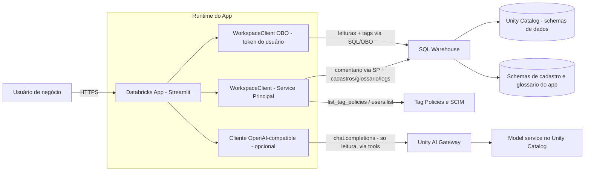

# 2. Arquitetura

## Componentes

| Componente | Papel |
|---|---|
| **Streamlit** | Interface web (`st.navigation`), rodando como **Databricks App**. |
| **databricks-sdk** (`WorkspaceClient`) | Dois clientes: um com o **token do usuário logado** (on-behalf-of-user / OBO) e um com a identidade do **service principal** do app. |
| **Statement Execution API** (`w.statement_execution`) | Executa todo o SQL do app — navegação, metadados (`information_schema`), amostra, DDL de tags/comentário e os cadastros (`CREATE`/`INSERT`/`UPDATE`/`DELETE`) — contra um **SQL Warehouse**. A identidade que executa cada statement varia por operação (ver invariante abaixo). |
| **Tag Policies API** (`w.tag_policies`) | Lê o catálogo oficial de tags governadas (chaves + valores permitidos), lido pelo service principal. |
| **SCIM Users API** (`w.users`, opcionalmente `AccountClient.users`) | Busca de usuários do workspace/conta para os cadastros de steward e permissão. |
| **Unity AI Gateway** (opcional) | Backend do módulo Assistente de IA — ver seção dedicada abaixo. |
| **SQL Warehouse** | Motor que executa o SQL emitido pelo app (obrigatório). |
| **Unity Catalog** | Onde tags/comentários (governança) e as tabelas de cadastro do app são persistidos. |

> A navegação e a leitura de colunas usam **SQL** (`SHOW CATALOGS`,
> `SHOW SCHEMAS`, `information_schema.columns`/`column_tags`) e **não** as
> APIs `w.catalogs`/`w.schemas`/`w.tables`. Isso permite rodá-las
> **on-behalf-of-user**, exigindo apenas o scope OAuth `sql` do app e
> respeitando os grants reais do usuário.

## Dois modelos de autenticação (coexistem)

| Área | Executa como | Detalhe |
|---|---|---|
| **Governança de Dados** (tags e comentários) | **Leitura OBO · escrita mista** | **Leituras** (navegação, colunas, amostras, tags/comentário atuais) rodam com a identidade do **usuário logado** (OBO), respeitando os grants dele. **Tags** (`ALTER TABLE … SET/UNSET TAGS`) também rodam via **OBO** — são governadas pelas próprias permissões (`APPLY TAG`/`ASSIGN`) do Unity Catalog. **Comentário** (`COMMENT ON`) é a única escrita feita pelo **service principal** (que detém `MODIFY`), porque nenhum usuário de negócio deve ter `MODIFY` na tabela — isso liberaria escrita de **dados**, não só de metadado. Antes de gravar o comentário, um **portão de acesso** confirma via OBO que o usuário enxerga a tabela. |
| **Cadastros e Administração** | **Service principal do app** | Domínios, sub-domínios, stewards, dashboards, padrões de dado pessoal, backlog de aprovação, usuários & permissões e o glossário de termos são dados **do app**, não do usuário. Quem pode **editar** cada tela é controlado por **RBAC** próprio (papel `admin`/`editor`/`leitor` + flags `ver_cadastros`/`ver_logs`/`aprovador_tags`), não pelas permissões de Unity Catalog do usuário. |
| **Assistente de Governança (IA)** | **Service principal do app** | O chat consulta as mesmas fontes de leitura acima (via *function calling*), sempre como o service principal — não herda os grants do usuário que está perguntando. É só consulta: nenhuma tool de escrita é exposta ao modelo. |

`USE_ON_BEHALF_OF_USER=true` habilita o modo OBO. Se o token do usuário não
estiver disponível (app sem o scope `sql` habilitado, ou execução local), o
app cai automaticamente para o service principal nas leituras — nesse caso o
portão de acesso deixa de discriminar por usuário, então mantenha o OBO
habilitado em produção.

### 🔒 Invariante de identidade

- **Leituras/navegação do catálogo → OBO.** Nunca via service principal.
- **Tags governadas → OBO.** Seguem as permissões do próprio Unity Catalog;
  quem não tiver `APPLY TAG`/`ASSIGN`, simplesmente não aplica.
- **Comentário → Service Principal.** Única exceção: o SP empresta o `MODIFY`
  só para o comentário, sempre atrás do portão de acesso por usuário.
- **Cadastros, glossário, logs de auditoria → Service Principal.** Não são
  objetos de negócio do Unity Catalog; a invariante acima não se aplica a eles.

## Regra de compliance de dado pessoal

Colunas cujo nome casa com um **padrão de dado pessoal** cadastrado (ex.:
`cpf`, `email`) exigem que as tags governadas `privacidade` e `seguranca`
tenham valores específicos (configurável no código, ver
[Módulo — Governança de Dados](./07-modulo-governanca-dados.md)). Uma
tentativa de aplicar/alterar/remover essas chaves em desacordo com a regra
**não é executada no Unity Catalog** — vai para um **backlog de aprovação**
(tabela interna do app) até um aprovador decidir. Essa regra roda **antes**
do `ALTER TABLE … TAGS`, dentro do próprio fluxo de escrita da Governança.

## Onde entra o Unity AI Gateway (Assistente de IA)

O módulo de Assistente de Governança é **opcional** (`LLM_ENABLED=false` por
padrão) e usa o **Unity AI Gateway** do próprio workspace de destino — não um
serviço externo. O app monta um cliente compatível com a API da OpenAI
apontando para `{host-do-workspace}/ai-gateway/mlflow/v1`, autenticado com um
token OAuth do service principal obtido na hora (não cacheado, pois o token
expira). O modelo consultado é identificado por `LLM_ENDPOINT` — o **nome
completo** (`catalogo.schema.nome_do_modelo`) de um **model service**
registrado no Unity Catalog daquele workspace, servido pelo AI Gateway.

> Isso significa que o modelo de IA usado **não é fixo no código** — cada
> instalação aponta para o model service que existir (ou for criado) no seu
> próprio workspace. Ver pré-requisitos em
> [03. Pré-requisitos](./03-pre-requisitos.md) e detalhes em
> [09. Módulo — Assistente de Governança (IA)](./09-modulo-assistente-ia.md).

## Diagrama de componentes

