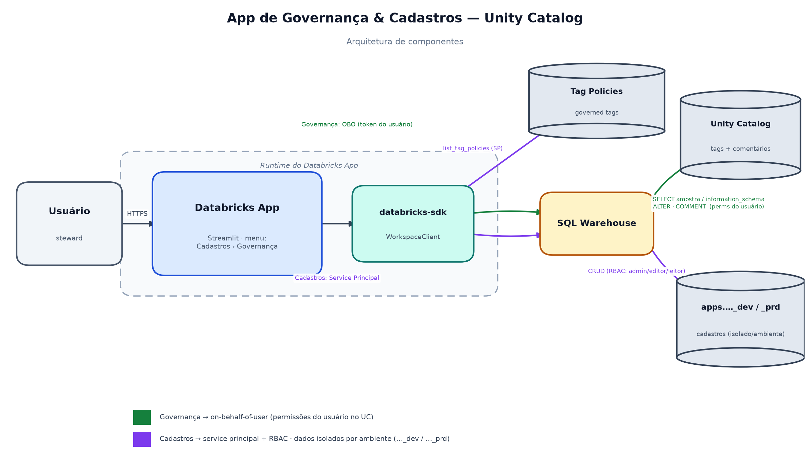

# 2. Arquitetura

## Componentes

| Componente | Papel |
|---|---|
| **Streamlit** | Interface web com `st.navigation` (grupos **Cadastros** e **Governança**): seletores, tabela de colunas, editor e telas de cadastro. |
| **databricks-sdk** (`WorkspaceClient`) | Dois clientes: um com o **token do usuário** (OBO, `auth_type="pat"`) e um com a identidade do **service principal** do app. |
| **Statement Execution API** (`w.statement_execution`) | Executa **todo** o SQL do app — navegação (`SHOW CATALOGS/SCHEMAS`), metadados (`information_schema`), amostra, DDL (`ALTER`/`COMMENT`) e os cadastros (`CREATE/INSERT/UPDATE/DELETE`) — num **SQL Warehouse**. A **identidade** varia por operação (ver invariante abaixo). |
| **Tag Policies API** (`w.tag_policies`) | Lê o catálogo oficial de tags governadas (chaves + valores permitidos). Lido pelo **service principal**. |
| **SCIM Users API** (`w.users`) | Lista usuários do workspace (busca de steward/permissão). Lido pelo **service principal**. |
| **SQL Warehouse** | Motor que executa o SQL emitido pelo app. |
| **Unity Catalog** | Onde tags e comentários (governança) e as tabelas de cadastro (catálogo `apps`) são persistidos. |

> **Importante:** a navegação e a leitura de colunas usam **SQL**
> (`SHOW CATALOGS`, `SHOW SCHEMAS`, `information_schema.columns/column_tags`) e
> **não** as APIs `w.catalogs`/`w.schemas`/`w.tables`. Isso permite rodá-las
> **on-behalf-of-user** (OBO) exigindo apenas o scope `sql` e respeitando as
> permissões do usuário.

> ### 🔒 Invariante de identidade (regra fixa — não mudar sem motivo forte)
> - **Leituras/navegação do catálogo → OBO** (token do usuário). Nunca via SP.
> - **Tags governadas (`ALTER TABLE … SET/UNSET TAGS`) → OBO.** As tags são
>   governadas pelas permissões do próprio Unity Catalog (`APPLY TAG`/`ASSIGN`);
>   quem não tiver a permissão simplesmente não aplica. **Não use SP para tags.**
> - **Comentário (`COMMENT ON TABLE/COLUMN`) → Service Principal.** É a **única**
>   exceção: nenhum usuário terá `MODIFY` na tabela (isso liberaria escrita de
>   dados), então o SP empresta o `MODIFY` só para o comentário. Antes de gravar,
>   `user_can_access_table` confirma via OBO que o usuário já enxerga a tabela.
> - **Cadastros e logs internos do app** (catálogo `apps`) → SP. Não são tabelas
>   do catálogo de negócio; a invariante acima não se aplica a eles.

## Diagrama de componentes



> Versão em imagem (PNG) para apresentações em `docs/img/arquitetura.png`. As
> versões em Mermaid abaixo renderizam direto no Azure DevOps e são fáceis de
> editar. A Governança usa **OBO nas leituras e nas tags**; o **service principal
> só grava o comentário** (com portão de acesso por usuário). Os Cadastros e os
> logs de auditoria usam o **service principal**.

```mermaid
flowchart LR
    U[Usuário de negócio] -->|HTTPS| APP[Databricks App<br/>Streamlit]

    subgraph APP_RT[Runtime do App]
      APP --> OBO[WorkspaceClient OBO<br/>token do usuário]
      APP --> SP[WorkspaceClient<br/>Service Principal]
    end

    %% Fluxo Governança — LEITURAS via OBO (executa como o usuário logado)
    OBO -->|execute_statement LEITURA<br/>SHOW CATALOGS/SCHEMAS<br/>information_schema<br/>SELECT amostra<br/>portão de acesso| WH[SQL Warehouse]

    %% Tags via OBO (permissões do UC do usuário)
    OBO -->|execute_statement<br/>ALTER TABLE ... SET/UNSET TAGS| WH
    %% Service Principal — SÓ comentário no catálogo + tags policies/SCIM + cadastros/logs
    SP -->|list_tag_policies| TP[(Tag Policies<br/>Governed Tags)]
    SP -->|users.list| SCIM[(Usuários do<br/>workspace - SCIM)]
    SP -->|execute_statement<br/>COMMENT ON (só comentário)| WH
    SP -->|execute_statement<br/>CREATE/INSERT/UPDATE/DELETE| WH
    WH -->|persiste tags OBO + comentários SP| UC[(Unity Catalog<br/>schemas de dados)]
    WH -->|persiste cadastros + logs| APPS[(Catálogo apps<br/>governanca_unity_catalog_&lt;env&gt;)]
```

## Fluxo de uma sessão

```mermaid
sequenceDiagram
    actor U as Usuário
    participant APP as App (Streamlit)
    participant OBO as SDK (OBO / usuário)
    participant SP as SDK (Service Principal)
    participant WH as SQL Warehouse
    participant UC as Unity Catalog

    Note over APP,SP: Bootstrap — cria tabelas de cadastro e resolve o papel (RBAC)
    APP->>SP: ensure_cadastro_tables (CREATE IF NOT EXISTS) + seed admin
    APP->>SP: get_role(usuario) → admin/editor/leitor

    Note over APP,OBO: Página Governança (OBO)
    U->>APP: Seleciona Catalog → Schema → Table
    APP->>OBO: SHOW CATALOGS/SCHEMAS + information_schema (filtrado por env + allowlist)
    APP->>OBO: information_schema.columns / column_tags (colunas e tags aplicadas)
    APP->>SP: list_tag_policies (catálogo de tags governadas)
    U->>APP: Edita comentário da tabela / coluna / tag e clica "Salvar"
    APP->>OBO: portão de acesso — information_schema.tables (usuário enxerga a tabela?)
    OBO-->>APP: sim → libera / não → bloqueia
    APP->>OBO: ALTER TABLE ... SET|UNSET TAGS (tags = permissões do usuário)
    APP->>SP: COMMENT ON TABLE|COLUMN ... (só o comentário; SP detém MODIFY)
    OBO->>WH: aplica/remove tag como o usuário
    SP->>WH: grava comentário como o service principal
    WH->>UC: Persiste metadados
    WH-->>APP: OK / erro
    APP->>SP: registra auditoria (log_comentarios / log_tags) no catálogo apps
    APP-->>U: st.success / st.error

    Note over APP,SP: Páginas Cadastros (Service Principal + RBAC)
    U->>APP: Cria/edita domínio, sub-domínio, steward ou permissão
    APP->>SP: INSERT/UPDATE/DELETE (se can_edit(role)) no catálogo apps
```

## Decisões técnicas

| Decisão | Motivo |
|---|---|
| **Leituras + tags via OBO; só comentário via SP** (`USE_ON_BEHALF_OF_USER=true`) | Leituras e **tags** rodam como o usuário (tags herdam `APPLY TAG`/`ASSIGN` do UC). O **SP grava apenas o comentário** (detém `MODIFY`), pois nenhum usuário tem `MODIFY` — evita liberar escrita de dados. `user_can_access_table` valida via OBO, antes do comentário, que o usuário enxerga a tabela: só documenta o que tem acesso. |
| **Auditoria de comentários e tags** (`log_comentarios`, `log_tags` no catálogo `apps`) | Como o comentário roda via SP, o UC não guarda o autor real; o app registra o **usuário logado (OBO)** que solicitou cada inserção/alteração/remoção. Tags também são logadas (executor = OBO). Visível em **Auditoria** para admin ou quem tiver a flag `ver_logs`. |
| **`auth_type="pat"` no cliente OBO** | Força o SDK a usar **apenas** o token do usuário. Sem isso, o SDK também detecta as credenciais OAuth do SP injetadas no ambiente e falha com *"more than one authorization method configured: oauth and pat"*. |
| **Navegação/colunas via SQL (não via `w.catalogs`/`w.tables`)** | Permite rodar sob OBO exigindo só o scope `sql` e respeitando os grants do usuário. |
| **Service principal nos Cadastros** | São dados do app (não do usuário); o SP grava em `apps.…`. Quem pode editar é decidido por **RBAC** (tabela `permissoes`), não pelas permissões de UC do usuário. |
| **Tag Policies API para listar tags governadas** (lida pelo SP) | O `information_schema.column_tags` mostra apenas tags **já aplicadas**, não o catálogo de valores **permitidos**. A Tag Policies API é a fonte oficial. |
| **Uma coluna por `ALTER`** | O UC não permite `SET TAGS` em várias colunas no mesmo `ALTER TABLE`. |
| **Quoting manual com escaping** (crase para identificadores, `''` para literais) | `SET TAGS` não aceita parâmetros (`?`/`:key`); os valores precisam ir no SQL com escaping seguro. |
| **App environment-aware + grants por schema** | Metastore unificado exige fronteira lógica (filtro por sufixo) e real (grants/OBO) entre dev e prd. Ver [Ambientes](./05-ambientes-e-sync.md). |
| **Cache do Streamlit** (`st.cache_data`/`st.cache_resource`) | Reduz chamadas repetidas ao SDK/warehouse; chaveado por usuário nas leituras OBO; invalidado após cada escrita. |
